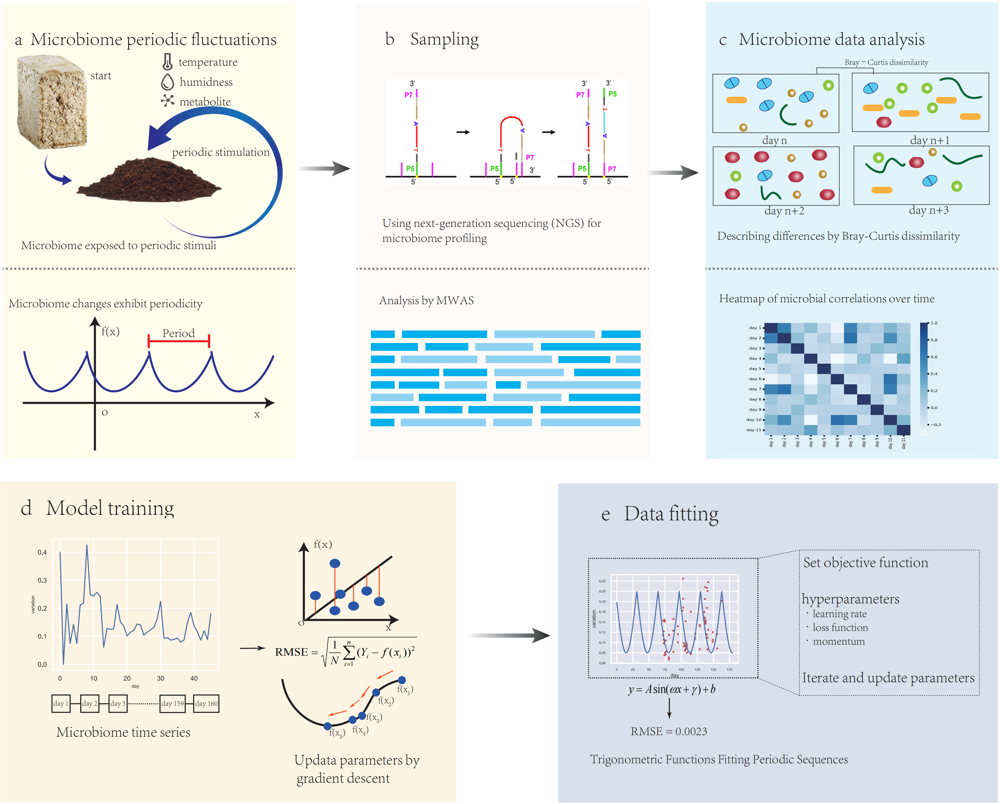

# MicroGradient

MicroGradient, a machine learning model based on gradient descent algorithm for prediction of trends in microbial genomes.

<div style="text-align: center;">
  
  <p style="font-style: italic;">Fig1 (A) Baijiu making requires repeated distillation, during which the microbiome changes periodically (B)The microbiome was identified by 16s sequencing (C)Calculate differences of the microbiome (D)Gradient descent was used to optimise the model and RMSE is the loss function (E)Gradient descent to fit parameters</p>
</div>

## Explanation
Traditional Chinese baijiu is one of the world's six distilled spirits. It has a long history, is produced using a unique brewing method and is a major contributor to the global spirits industry. Its production process consists of a special combination of solid-state microbial fermentation for baijiu brewing and steam bucket distillation to produce a variety of baijiu styles. Sorghum is used as the raw material for solid-state baijiu brewing. Daqu is used as a saccharification fermentation agent. Chinese baijiu is produced by solid-state fermentation, solid-state distillation, storage and blending.

The process of brewing Baijiu begins by breaking raw materials. Hot water above 90°C is then added to the grains, increasing their moisture content to 37-40%. Subsequently, 10% of the source Zaopei is added to the moistened grains, and the mixture is steamed for more than two hours. After steaming, the grains are cooled to room temperature and mixed with 10% Daqu and 2% tail liquor (a distilled wine of poor quality).
The resulting mixture is stacked and left to ferment for 4-5 days, during which the temperature rises to 48-52°C. Following this initial stacking fermentation, the Zaopei is transferred to a cellar for a further month of fermentation. After the cellar fermentation is complete, the Zaopei is removed from the pit, and the remaining 50% of the raw materials are added after a brief waiting period.
These remaining raw materials are broken, and hot water above 90°C is added to achieve a moisture content of 37-40%. These grains are then combined with the previously fermented Zaopei. The mixture undergoes the same steps of steaming, cooling, mixing, stacking fermentation, and cellar fermentation as before.
Finally, the fully fermented grains are distilled in a steaming bucket, yielding the final Baijiu product.

The production process of Baijiu is traditional and depends on natural fermentation environments and the enrichment of various microorganisms, and produces a variety of enzymes and microbial metabolites dominated by glucoamylase. The main microorganisms in the Daqu are bacteria, molds, and yeasts. Of these, bacteria constitute the largest numbers, followed by molds and yeasts. In terms of species diversity, however, the molds are the most abundant with up to 51 species, followed by bacteria with 41 species. In high-temperature Daqu production, the temperature can reach >60 °C, and microbial compositions vary at different temperature stages. At lower temperatures, yeasts, molds, and certain bacteria accumulate in large quantities and produce high levels of enzymes and other metabolites. The enzymes hydrolyze the proteins present in the system to various amino acids. The enzymes and amino acids also undergo Maillard- and other chemical reactions generating compounds contributing to the characteristic Maotai-flavor. At higher temperatures, only heat-tolerant bacilli and bacteria remain, and these produce large quantities of metabolites that may undergo complex reactions and generate additional flavor compounds .When making distilled spirits, multiple distillations are usually performed to purify the alcohol concentration. Considering the effects of repeated distillations, the microbiome of distilled spirit shows periodic changes with distillation.The wine was sampled uninterruptedly during the 160-day distillation process. Abundance data of microorganisms of wine were obtained from the samples and correlation coefficients were calculated between them. The correlation coefficients give a more obvious picture of the periodic changes in the microbiome.MicroGradient was fitted to the microbiome variation by the gradient descent algorithm to predict the trend of their correlation coefficients.

Considering the cyclical nature of microbial changes in wine during distillation Fig.1(A), we wanted to predict changes in the microbiome. There are many approachs to quantify the dissimilarity between microbial communities, such as Euclidean Distance,Manhattan Distance,Jaccard Index,Bray-Curtis Dissimilarity,and they all worked well.Considering the periodicity of microbiome changes in distillation, we used a periodic function to predict microbiome changes Fig.1(E).RMSE is a common loss function used in regression problems. It measures the average magnitude of the errors between the predicted values and the actual values Fig.1(F). The model adopts the random initialization and the parameters were updated by gradient descent.

## Download
Download MicroGradient using git:
```shell
git clone https://github.com/2275836125/MicroGradient.git
```

## Usage
MicroGradient could predict trends of microbial genomes.The process involves some steps:

1. Obtain microbiome abundance data.
2. Calculation of correlation coefficients from microbiome abundance data.
3. Data preprocessing to conform data to input format.
4. Predict microbiome trends by MicroGradient.


